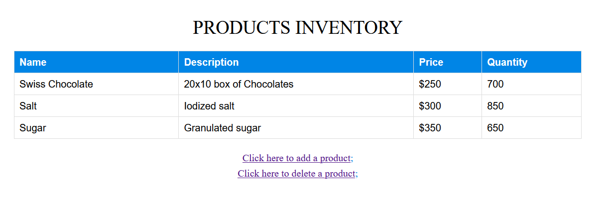
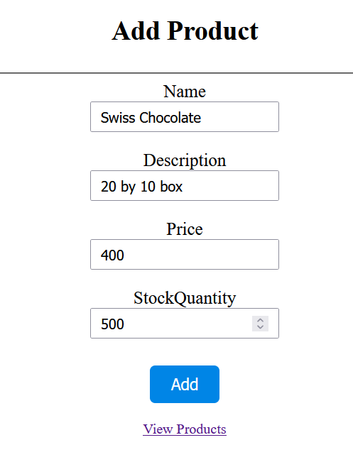
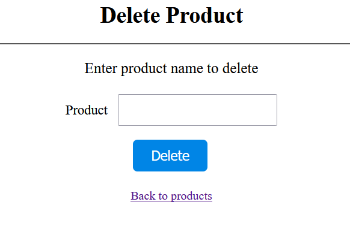

## Product Inventory Management
This is a Model-View-Controller (MVC) web application that allows you interact with a product catalog. You can add, view, and delete products.

Quickly, you will see how to run the application and a brief overview of features

### Built With


## Demo
A demo is shown below:



## Getting Started
Follow these steps to run the application:

1. Download the project as a zipped folder
2. Extract the project folder. 
3. Open the folder, click on the ```ProductInventoryManagement.csproj.user``` to open the project in visual studio code
4. Open the ```index.cshtml``` file in ```Product``` folder
5. Click on ```IIS Express``` play button to compile and run the application.

This should prompt your browser to open and you will see a list of products, with information such as price and stock quantity.

There are two links, one to add a product and the other, to delete a product.

To add a product, click on the first link. This opens a new page where you can enter a product name and other details to add a new product. Once you enter the details, click on the ```Add``` button to complete the process.



Likewise, to delete a product, click on the second link. This opens a new page where you can enter the product name and it will be deleted from inventory.



From both pages, you can navigate to the home page a link at the bottom - ```Back to list```

There is no special instruction as the application is fairly easy to use. Hope you enjoy using this application!